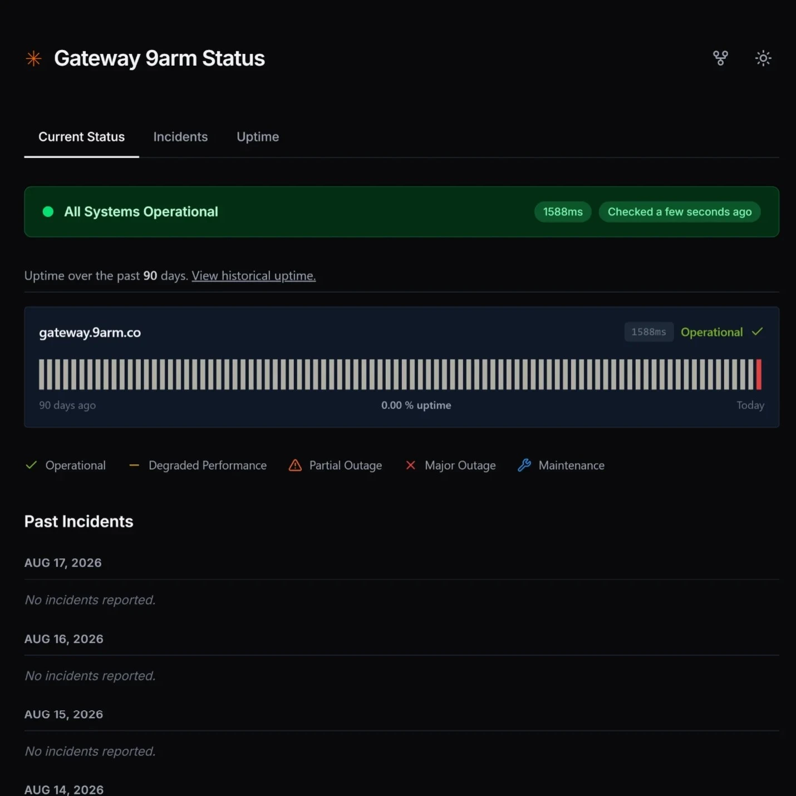

# Open Status Page

An open-source, community-run status monitor for **[gateway.9arm.co](https://gateway.9arm.co)** — an Anthropic-compatible API gateway. Built with React 19, TypeScript, Vite, and Supabase.

> **Disclaimer:** This project is not affiliated with or endorsed by the operators of `gateway.9arm.co`. It is an independent community tool for checking whether the gateway is publicly reachable.

🟢 **Live:** [open-status-page.sinon-7cf.workers.dev](https://open-status-page.sinon-7cf.workers.dev)


<br />



---

## ✨ Features

- **Telegram broadcast channel (Thai)** — instant outage, elevated latency, and recovery notifications via [**@gateway9armstatus**](https://t.me/gateway9armstatus) (powered by `@th9arm_bot`)
- **"Subscribe to Updates" modal** — one-click Telegram subscription directly from the status header
- **Multi-endpoint monitoring** — concurrently verifies:
  1. `API Gateway (HTTP / Models)` — HTTP proxy & model registry (`GET /v1/models`)
  2. `Model: Qwen 3.8 27B` — inference pipeline on `qwen3.8-27b-fp8` (`POST /v1/messages`)
  3. `Model: DeepSeek v4 Flash` — *(Temporarily disabled per 9arm testing announcement [ref: Discord message](https://discord.com/channels/826099393694400574/1512469795218653417/1540781941148622928); ready for re-activation)*
- **288-entry granular check grid (Default)** — visualizes all 288 5-minute health check intervals over the past 24 hours to pinpoint exact intraday outage windows
- **Click-to-Copy diagnostic JSON** — click any health check bar, daily block, or latency point to instantly copy formatted diagnostic JSON data
- **Multi-color 24h response time chart** — continuous multi-line latency sparkline with individual color coding:
  - 🔵 **API Gateway** (`#3b82f6`)
  - 🟣 **Model: Qwen 3.8 27B** (`#8b5cf6`)
  - 🟡 **Model: DeepSeek v4 Flash** (`#f59e0b`)
- **24-hour incident indicators** — live counter badges on the status banner, past incidents summary, and notification badge on tabs
- **Functional pagination** — quarterly 3-month navigation with boundary controls across Uptime and Incident history
- **Component & Impact filtering** — filter incidents by specific service and severity level (`Critical`, `Major`, `Minor`, `Informational`) with quick reset
- **Automated incident lifecycle** — auto-creates incidents on hard outages/severe latency and auto-resolves when services normalize
- **Admin portal (`/admin`)** — post, edit, resolve, and delete incidents directly from the web UI (authenticated via Supabase Service Role Key)
- **Dark mode** — persisted via `localStorage`, respects OS preference
- **URL-synced tabs** — `/`, `/incidents`, `/uptime`, `/admin` with browser back/forward support
- **Auto-refresh** — polls for new data silently every 60 seconds

---

## 🏗️ Tech Stack

| Layer | Technology |
|---|---|
| Frontend | React 19 + TypeScript + Vite |
| Styling | Tailwind CSS v4 |
| Typography | Inter (Google Fonts) |
| Icons | Lucide React |
| Backend / DB | Supabase (PostgreSQL + Edge Functions) |
| Hosting | Cloudflare Workers (static assets) |
| Date handling | Day.js |
| Notifications | Telegram Bot API (`@th9arm_bot`) |

---

## 🚀 Self-Hosting Guide

### Prerequisites

- [Node.js](https://nodejs.org/) 18+
- [Supabase account](https://supabase.com) (free tier is sufficient)
- [Cloudflare account](https://cloudflare.com) (for deployment)

### 1. Clone the repository

```bash
git clone https://github.com/pakorn269/open-status-page.git
cd open-status-page
```

### 2. Install dependencies

```bash
npm install
```

### 3. Set up environment variables

```bash
cp .env.example .env
```

Edit `.env` with your values:

| Variable | Where to find it |
|---|---|
| `VITE_SUPABASE_URL` | Supabase → Project Settings → API → Project URL |
| `VITE_SUPABASE_ANON_KEY` | Supabase → Project Settings → API → `anon` key |
| `SUPABASE_URL` | Your project reference ID (e.g. `abcdefghijklmnop`) |
| `SUPABASE_SERVICE_ROLE_KEY` | Supabase → Project Settings → API → `service_role` key (**keep secret**) |
| `ANTHROPIC_AUTH_TOKEN` | The API key used to authenticate health-check pings |
| `TELEGRAM_BOT_TOKEN` | Bot token from [@BotFather](https://t.me/BotFather) for broadcasting alerts |
| `TELEGRAM_CHAT_ID` | Telegram Channel username or chat ID (e.g. `@gateway9armstatus`) |

> `VITE_SUPABASE_URL` and `VITE_SUPABASE_ANON_KEY` are **public-safe** — they're the anon key protected by Row Level Security and are hardcoded as fallbacks in `src/lib/supabase.ts` for static asset deployments.
> Never commit your `service_role` key, `ANTHROPIC_AUTH_TOKEN`, or `TELEGRAM_BOT_TOKEN`.

### 4. Set up the Supabase database

Run these SQL files **in order** in the [Supabase SQL Editor](https://supabase.com/dashboard/project/_/sql):

```
1. supabase/setup_api_logs.sql   — Creates api_status_logs table + get_uptime_90_days() RPC
2. supabase/setup.sql            — Creates incidents table + seeds sample data + schedules cron job
```

> **Before running `setup.sql`:** Replace `YOUR_PROJECT_REF` on the last line with your actual Supabase project reference ID.

### 5. Deploy the Edge Function

```bash
# Set secrets (these are injected into the Edge Function at runtime)
npx supabase secrets set ANTHROPIC_AUTH_TOKEN=your_api_key_here --project-ref YOUR_PROJECT_REF
npx supabase secrets set SERVICE_ROLE_KEY=your_service_role_key_here --project-ref YOUR_PROJECT_REF
npx supabase secrets set TELEGRAM_BOT_TOKEN=your_telegram_bot_token --project-ref YOUR_PROJECT_REF
npx supabase secrets set TELEGRAM_CHAT_ID=@gateway9armstatus --project-ref YOUR_PROJECT_REF

# Deploy
npx supabase functions deploy health-check --project-ref YOUR_PROJECT_REF
```

The Edge Function is scheduled automatically by `pg_cron` to run every 5 minutes. It concurrently checks all configured endpoints, logs response times, and broadcasts Thai alerts to Telegram on state changes.

### 6. Run locally

```bash
npm run dev
```

Open [http://localhost:5173](http://localhost:5173).

---

## 📢 Telegram Broadcast Alerts

The status page is integrated with Telegram for zero-latency outage notices:
1. **Public Channel:** Users can join [**@gateway9armstatus**](https://t.me/gateway9armstatus) by clicking **"Subscribe to Updates"** on the header.
2. **Automated Thai Notifications:**
   - 🔴 **Outage Detected:** Sends formatted alert specifying which service failed and HTTP status code.
   - ⚠️ **Elevated Latency:** Alerts if latency exceeds twice normal threshold.
   - 🟢 **Full Recovery:** Broadcasts a recovery notice with list of resolved services once all checks normalize.

---

## 🛡️ Admin Portal

To manage incidents without touching SQL:
1. Navigate directly to `/admin` in your browser (e.g. `http://localhost:5173/admin`).
2. Enter your **Supabase Service Role Key** to unlock the management interface.
3. Post new incidents, update existing statuses, or click **Resolve** to close active outages.
4. Active incidents are also automatically closed when all automated health checks recover.

---

## ☁️ Deploy to Cloudflare Workers

1. Push to GitHub
2. Go to [Cloudflare](https://dash.cloudflare.com/) → **Workers & Pages** → connect your repo
3. Set the build configuration:

| Setting | Value |
|---|---|
| Framework preset | **Vite** |
| Build command | `npm run build` |
| Output directory | `dist` |

4. Add environment variables:
   - `VITE_SUPABASE_URL`
   - `VITE_SUPABASE_ANON_KEY`

5. Deploy. SPA routing (`/incidents`, `/uptime`, `/admin`) is handled by [`public/_redirects`](public/_redirects).

---

## 📁 Project Structure

```
open-status-page/
├── .vscode/
│   └── settings.json                # Scopes Deno language server to supabase/functions/
├── public/
│   ├── _redirects                   # SPA routing fallback
│   ├── open-status-page.sinon-7cf.workers.dev.webp # UI preview screenshot
│   └── favicon.webp                 # Favicon / Website Logo
├── src/
│   ├── components/
│   │   ├── Header.tsx               # Logo + Language Switcher + Subscribe + GitHub + Dark Mode
│   │   ├── SubscribeModal.tsx       # Telegram subscription modal (@gateway9armstatus)
│   │   ├── StatusBanner.tsx         # Animated status indicator with 24h incident badge
│   │   ├── ComponentList.tsx        # Multi-service list + 288-check grid & click-to-copy
│   │   ├── ResponseTimeChart.tsx    # Multi-color 24h latency chart with endpoint filter tabs
│   │   ├── UptimeGrid.tsx           # 90-day calendar uptime grid with service selector
│   │   ├── IncidentHistory.tsx      # Full incident log with component & impact filters
│   │   ├── PastIncidents.tsx        # 14-day incident summary with 24h counter badge
│   │   ├── Footer.tsx               # 9arm community hubs & open-source credits
│   │   └── AdminPanel.tsx           # Secure incident management portal (/admin)
│   ├── lib/
│   │   ├── supabase.ts              # Supabase client
│   │   ├── translations.ts          # Thai & English localized UI strings
│   │   ├── LanguageContext.ts       # React Language Context hook
│   │   ├── LanguageProvider.tsx     # Language state provider (TH/EN)
│   │   └── incidentTranslator.ts    # Automated incident status translation
│   ├── App.tsx                      # Main app — state orchestration, multi-endpoint sync
│   ├── index.css                    # Tailwind + Inter font + shimmer/pulse animations
│   └── main.tsx
├── supabase/
│   ├── functions/
│   │   └── health-check/
│   │       ├── index.ts             # Parallel multi-endpoint check & Telegram broadcast logic
│   │       └── deno.json            # Deno compiler config for IDE support
│   ├── setup.sql                    # incidents table + cron schedule
│   ├── setup_api_logs.sql           # api_status_logs table + 90-day uptime RPC
│   └── upgrade_uptime_rpc.sql       # Per-endpoint weighted 90-day uptime RPC
├── .env.example                     # Environment variable template
└── DESIGN.md                        # Design system reference
```

---

## 🌐 9arm Community & Ecosystem

This status monitor observes **[gateway.9arm.co](https://gateway.9arm.co)**. Special thanks and credits to **นายอาร์ม (9arm)** and the developer community:

- 📺 **YouTube Channel**: [@9arm.](https://www.youtube.com/@9arm.) — Live streams, tech discussions, and supporter perks
- 🐦 **X (Twitter)**: [@castby9arm](https://x.com/castby9arm) — Tech updates, thoughts, and announcements
- 👥 **Facebook Group**: [Behind the Scenes with 9arm](https://www.facebook.com/groups/9arm.community/) — Public space for tech discussions & community projects
- 💬 **Discord Server**: [discord.gg/9arm](https://discord.com/invite/9arm) — Tech community and Membership supporters chat
- 🌐 **Gateway Portal**: [gateway.9arm.co](https://gateway.9arm.co) — Anthropic-compatible API gateway

---

## 📄 License

MIT
